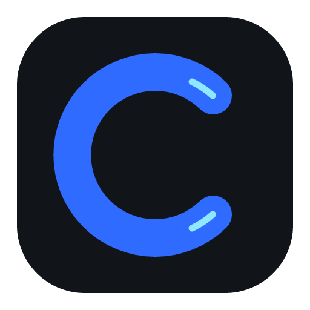
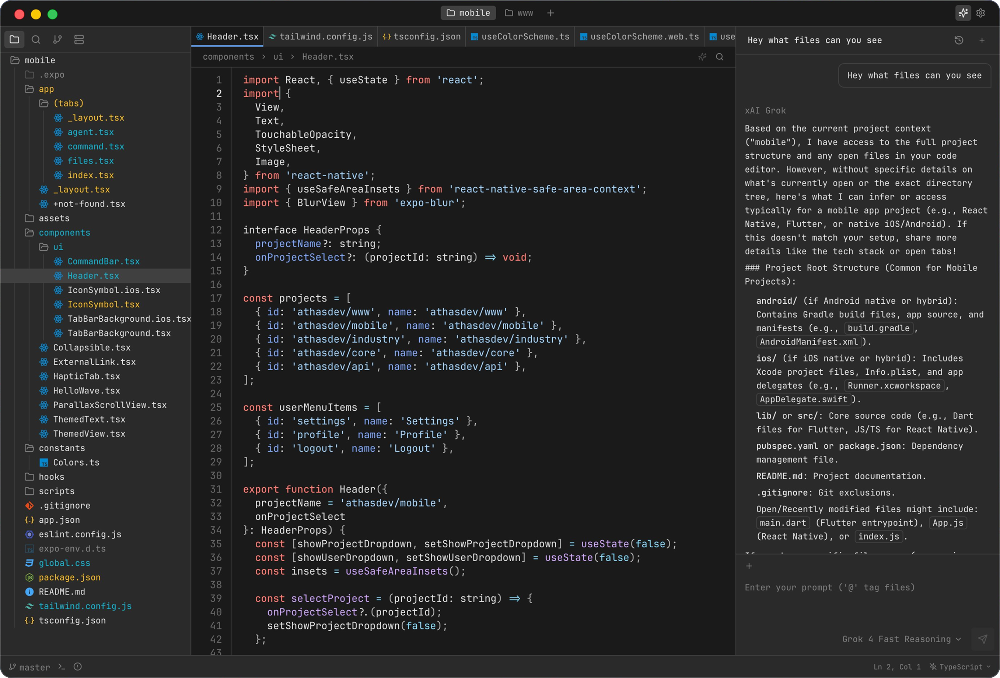

<div align="center">
  
  <h1>Coodi</h1>
  <p>A free, local-first AI code builder built with Tauri, Rust, and React.</p>
  
</div>

## About Coodi

**Coodi** is an independently maintained open-source desktop code builder. It is released under the **GNU Affero General Public License v3 or later**, with the applicable copyright notices and attribution requirements preserved.

Coodi is deliberately **account-free, subscription-free, and BYOK-only**. It does not require registration, login, billing, a hosted account, or a Pro upgrade. Users connect providers with their own API keys, while local providers such as Ollama can run without a cloud key. Provider credentials are stored through the desktop secure-storage implementation using the OS keychain when available.

> Coodi sends AI requests directly to the provider selected by the user. It does not route requests through an upstream paid hosted-AI service, and cloud settings synchronization is disabled.

## Included capabilities

| Capability | Coodi implementation |
| --- | --- |
| Code workspace | Editor, syntax highlighting, LSP support, Vim keybindings, file explorer, search, terminal, Git, GitHub, remote, WSL, Docker, debugger, database, and extension infrastructure. |
| AI providers | OpenAI, Anthropic, Gemini, Grok, DeepSeek, Mistral, Qwen, OpenRouter free models, NVIDIA NIM models, custom OpenAI-compatible endpoints, and Ollama. |
| OpenRouter | The model catalog is filtered to models marked free by the provider catalog, including `:free` models and zero-priced entries. |
| NVIDIA NIM | The authenticated NVIDIA catalog is loaded from NVIDIA's OpenAI-compatible endpoint with the user's own NVIDIA API key. |
| Secure API keys | Provider keys are stored using the desktop keychain integration and are never sent to a Coodi account service. |
| Branding | Product name, desktop identifier, menus, documentation links, footer attribution, extension metadata, and update URLs use the Coodi identity. |

## Using Coodi

Launch Coodi, open **Settings → Agent**, select a provider, and add your own API key. Then choose a model from the provider catalog. OpenRouter users can create a key at [OpenRouter Keys](https://openrouter.ai/keys), and NVIDIA users can create a key at [NVIDIA Build](https://build.nvidia.com/settings/api-keys). For local inference, run Ollama and select the Ollama provider.

The application works without any account. Projects, editor state, settings, and provider credentials remain local to the device unless the selected provider receives a request made with the user's key.

## Development

This Coodi refresh uses **pnpm** for JavaScript dependencies. The source archive intentionally excludes generated dependencies and build output.

```bash
pnpm install --ignore-scripts --config.block-exotic-subdeps=false
./node_modules/.bin/tsc --noEmit
./node_modules/.bin/vp lint .
./node_modules/.bin/vp build
cargo check --workspace
cargo fmt --all -- --check
```

For Linux packaging, use the scripts under `scripts/release/`. For Windows x64 packaging, use `scripts/build-windows-nsis.sh` or `scripts/build-windows-gnu-nsis.sh`. The terminal-oriented Windows installer is `scripts/install/windows/Install-Coodi.ps1`; see [docs/INSTALL_WINDOWS.md](docs/INSTALL_WINDOWS.md).

For macOS packaging, run on a native macOS host. The build wrapper automatically selects Apple Silicon or Intel based on the host:

```bash
pnpm run build:mac
```

You can also select an architecture explicitly:

```bash
pnpm run build:mac:apple-silicon  # aarch64-apple-darwin
pnpm run build:mac:intel          # x86_64-apple-darwin
```

These commands produce `.app` and `.dmg` bundles under `src-tauri/target/<target>/release/bundle/`. Local builds are unsigned unless Apple signing environment variables are configured. See [docs/INSTALL_MACOS.md](docs/INSTALL_MACOS.md) for prerequisites, signing, and installation details.

## Project website and attribution

Visit [Coodi by Mubashir Hassan](https://www.mubashirhassan.com/coodi) for project information, documentation, support details, and release information. The desktop footer displays **“Coodi by Mubashir Hassan”** and links to the same page.

## License

Coodi is licensed under [AGPL-3.0-or-later](LICENSE). When distributing binaries or modified versions, provide the corresponding source and preserve the upstream license notices in accordance with the AGPL.
